# 🤘 Rawk On

Add songs from [The Current](https://www.thecurrent.org/playlist/the-current)'s
playlist to TIDAL — one track at a time, or a whole hour block at once.



A Chrome (Manifest V3) extension: hover a song card for a 🤘 **Add** pill, or use
**Add hour** in any hour header to bulk-capture that hour into its own playlist.

Manifest V3 · TypeScript · Vite · [CRXJS](https://crxjs.dev) · TIDAL OAuth (PKCE).

## What it does

- **Add a track** — hover a card, click 🤘 **Add**. It searches TIDAL, matches on
  **title + artist + album**, and files the song in a daily playlist
  (`The Current - YYYY-MM-DD`), de-duped.
- **Add an hour** — click **Add hour** on a block (e.g. `9 AM–10 AM`) to bulk-add
  every song to its own playlist (`The Current - <date> · 9 AM–10 AM`).
- **Right song, not just the popular one** — candidates are scored on title +
  artist + album; if nothing matches the title, it adds *nothing* rather than the
  wrong track.
- **Resilient** — backs off and retries on TIDAL's rate limit (HTTP 429).

## Privacy / security

- **No client secret.** Auth is Authorization Code + PKCE (the public-client flow).
  The only credential is the **client ID**, which is public by design.
- **Nothing sensitive in the bundle.** The client ID is entered at runtime and
  kept in `chrome.storage.local`; OAuth tokens live there too (same risk profile
  as a logged-in session cookie). The shipped extension contains no secrets.

## Prerequisites

- Node 20+ and npm
- A TIDAL developer application — https://developer.tidal.com

## Build & load

```bash
npm install
npm run build        # type-checks, then emits dist/
```

1. Go to `chrome://extensions`, enable **Developer mode**.
2. **Load unpacked** → select the `dist/` folder.

(`npm run dev` runs an HMR dev server if you're iterating.)

## Connect TIDAL (one-time)

1. Click the extension icon → **Settings & login**.
2. **Copy the Redirect URI** shown (e.g. `https://<extension-id>.chromiumapp.org/`).
3. In the [TIDAL developer portal](https://developer.tidal.com), open your app and
   add that exact URI to its **Redirect URIs**, then **Save** — login fails until
   you do this. (TIDAL requires HTTPS, non-localhost, no query params; the Chrome
   URI satisfies all three.)
4. Back in Settings, confirm the **Client ID**, **Save**, then **Log in to TIDAL**.

A `key` is pinned in `manifest.config.ts`, so the extension ID — and thus the
redirect URI — stays constant across reloads and machines.

> The account you log in with at the consent screen is the one whose playlists get
> created — sign in with your **listening** account, not (necessarily) the
> developer account that owns the app.

## Use it

Open <https://www.thecurrent.org/playlist/the-current>:
- Hover a card → 🤘 **Add** (the toast shows the matched title + time).
- Click **Add hour** in any hour header → the whole hour lands in its own playlist.

## Debugging

`DEBUG = true` in `src/shared/config.ts` logs every request in the service-worker
console (`chrome://extensions` → Rawk On → **service worker**).

- `await rawkSearch('artist title')` — in the **service-worker** console, prints
  TIDAL's ranked results for a query (rank, title, artists, album).
- `__tidalPoolSelfTest()` — in the **page** console, checks the DOM selectors.

If the page DOM changes and buttons stop appearing, the selectors live in one
place: `src/content/selectors.ts`.

## Project layout

```
manifest.config.ts          MV3 manifest (CRXJS) — pinned key, icons
docs/demo.svg               animated README demo
src/
  shared/
    config.ts               endpoints, scopes, DEBUG, playlist naming
    settings.ts             client ID in chrome.storage.local
    types.ts                shared types + message protocol
  background/
    service-worker.ts       message router (always responds)
    auth.ts                 PKCE login / refresh / logout
    tidal-api.ts            search · title+artist+album match · add · addHour · 429 backoff
    storage.ts              tokens + per-day/-hour playlist cache & dedup
  content/
    main.ts                 wire cards + hour headers, toasts
    selectors.ts            ⭐ DOM selectors (tune here if the page changes)
    extract.ts              card → { title, artist, album, songId }
    ui.ts                   Add pill, Add-hour pill, toasts
  options/                  settings + login hub
  popup/                    quick status + open settings
```

## Credits

Metal-hand icon: [Noun Project #1200426](https://thenounproject.com/icon/metal-hand-1200426/)
(CC BY) — add creator attribution if you distribute publicly.
