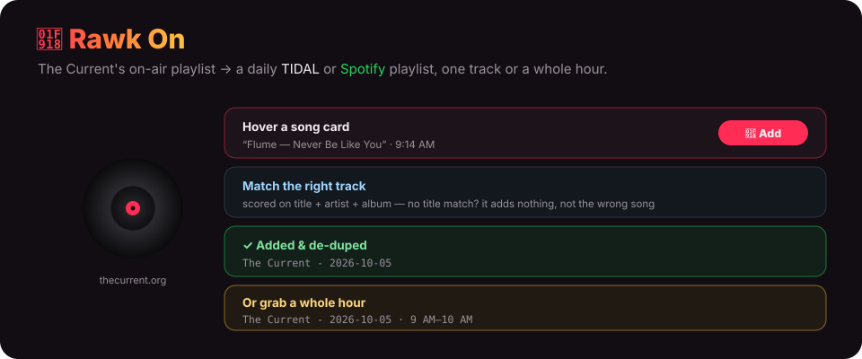
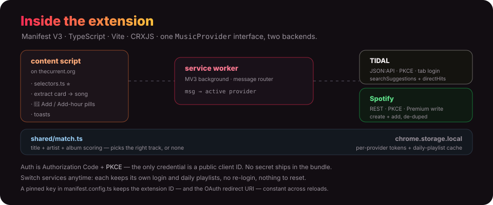

<p align="center">
  
</p>

<h1 align="center">🤘 Rawk On</h1>

<p align="center"><b>The Current's on-air playlist → a daily TIDAL or Spotify playlist.</b> A Chrome (Manifest V3) extension: add one track at a time, or bulk-capture a whole hour block.</p>

<p align="center">
  
  
  
  
  
</p>

---

## What it does

- **Add a track** — hover a card on [The Current](https://www.thecurrent.org/playlist/the-current), click 🤘 **Add**. It searches your chosen service, matches on **title + artist + album**, and files the song in a daily playlist (`The Current - YYYY-MM-DD`), de-duped.
- **Add an hour** — click **Add hour** on a block (e.g. `9 AM–10 AM`) to bulk-add every song to its own playlist.
- **The right song, not just the popular one** — candidates are scored; if nothing matches the title, it adds **nothing** rather than the wrong track.
- **Your choice of service** — switch between TIDAL and Spotify anytime. Each keeps its own login and its own daily playlists, so you can bounce back and forth with no re-login and nothing to reset.
- **Resilient** — backs off and retries on rate limits (HTTP 429), and handles The Current's full stream family (Radio Heartland, Purple Current, Carbon Sound, …), each scoped to its own daily playlist.

## How it's built

<p align="center">
  
</p>

One `MusicProvider` interface, two backends. The content script extracts song cards and renders the Add pills; the MV3 service worker routes messages to whichever provider is active; `shared/match.ts` does the title+artist+album scoring; `chrome.storage.local` keeps per-provider tokens and the daily-playlist cache.

> **Privacy:** auth is Authorization Code + **PKCE** (the public-client flow) for both services. The only credential is the **client ID**, which is public by design — no secret ships in the bundle. Client IDs are entered at runtime; OAuth tokens live in `chrome.storage.local` (same risk profile as a logged-in session cookie).

## Prerequisites

- Node 20+ and npm.
- A **paid subscription** for whichever service you use:
  - **TIDAL** — any paid plan (TIDAL discontinued its free tier in April 2024, so all active accounts are paid).
  - **Spotify** — **Premium** is required; the Web API blocks playlist writes for non-Premium accounts.
- A developer app for each service: [developer.tidal.com](https://developer.tidal.com) · [developer.spotify.com](https://developer.spotify.com/dashboard).

## Build & load

```bash
npm install
npm run build        # type-checks, then emits dist/
```

1. Go to `chrome://extensions`, enable **Developer mode**.
2. **Load unpacked** → select the `dist/` folder.

(`npm run dev` runs an HMR dev server for iterating.)

## Connect your music service (one-time)

1. Click the extension icon → **Settings & login**.
2. Choose **TIDAL** or **Spotify** using the tab at the top.
3. **Copy the Redirect URI** shown (e.g. `https://<extension-id>.chromiumapp.org/`).
4. In the developer portal, open your app, add that exact URI to its **Redirect URIs**, and **Save**. (Login fails until you do.)
5. Back in Settings, enter your **Client ID**, **Save**, then **Log in**.

Step-by-step guides: **[Connect Spotify](docs/setup-spotify.md)** · **[Connect TIDAL](docs/setup-tidal.md)**.

> Log in with your **listening** account — it's the one whose playlists get created. A pinned `key` in `manifest.config.ts` keeps the extension ID (and redirect URI) constant across reloads and machines.

**Spotify gotcha:** a new app starts in development mode, which surfaces as a confusing `403` on playlist writes (reads still work). The app owner needs Premium, **and** your listening account must be allowlisted under **User Management**. Full details in [Connect Spotify](docs/setup-spotify.md).

## Use it

Open <https://www.thecurrent.org/playlist/the-current>:

- Hover a card → 🤘 **Add** (the toast shows the matched title + time).
- Click **Add hour** in any hour header → the whole hour lands in its own playlist.

**Maintenance:** Settings → **Clear cached playlists** (per service, two-click confirm) for when you've deleted a daily playlist on the service and want a fresh one. Your login isn't affected.

## Debugging

Flip `DEBUG = true` in `src/shared/config.ts` to log every request in the service-worker console.

- `await rawkSearch('artist title')` — in the **service-worker** console, prints ranked results for the active provider.
- `__tidalPoolSelfTest()` — in the **page** console, checks the DOM selectors.

If the page DOM changes and buttons stop appearing, the selectors live in one place: [`src/content/selectors.ts`](src/content/selectors.ts).

## Chrome Web Store

See [docs/PUBLISHING.md](docs/PUBLISHING.md) and [docs/cws-listing.md](docs/cws-listing.md). Host [`public/privacy.html`](public/privacy.html), add a 1280×800 screenshot, and include the required icon attribution (below) in the listing.

## Credits

**Metal Hand** icon by **Berkah Icon** from the [Noun Project](https://thenounproject.com/icon/metal-hand-1200426/) (#1200426, CC BY). The same attribution appears in the Chrome Web Store listing.

## Changelog

**v1.1.2** — Fixed TIDAL search (migrated to `GET /searchSuggestions?filter[query]=…&include=directHits` after TIDAL retired the old path-parameter endpoint); fixed stream misdetection on The Current's Next.js client-side routing (active stream re-detected from the live URL on every add); add-track failures now log full details to the page console.

**v1.1.0–1.1.1** — Multi-stream support across The Current's stream family + Carbon Sound; tab-based TIDAL login to get past DataDome bot protection (intercepts the OAuth redirect via `webNavigation`).

**v1.0.x** — Initial TIDAL + Spotify support, paid-subscription docs, base single-stream capture.

<!-- org-footer -->
---

<p align="center"><sub>Part of <a href="https://github.com/ry-ops">ry-ops</a> · building the pipes between infrastructure, automation, and observability · built by <a href="https://github.com/ry-ops">ry-ops</a></sub></p>
